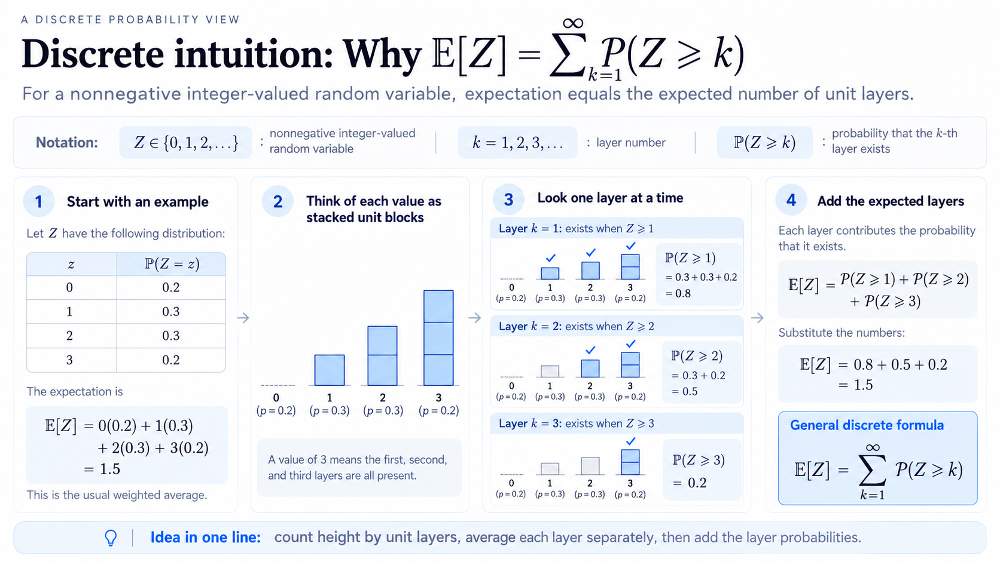

# Stick breaking

This is a common problem used to illustrate continuous random variables.

## Problem 1: Fixed point expectation

A unit stick is broken at $X\sim U(0,1)$. Let $p$ be a fixed point on the stick, and let $L_p$ be the length of the piece containing $p$.

Find $E[L_p]$. For which value of $p$ is this expectation maximized?

## Solution

**Defining $U$**

First, let $U$ be a uniform random variable on the interval from 0 to 1. Let its density be the constant $c$. Since a probability density must integrate to 1,

$\int_0^1 c\,du = 1$, so $c = 1$.

Therefore, $f_U(u) = 1$ for $0 < u < 1$.

The CDF is $F_U(x) = P(U \le x) = \int_0^x f_U(u)\,du = x$ for $0 \le x \le 1$.

More generally, if $U\sim U(a,b)$, its density is constant. Since the area under the density must be 1 and the interval has width $b-a$, the density must be $\frac{1}{b-a}$.

**General form of the expectation of a continuous random variable**

$$
E[g(X)] = \int g(x)f_X(x)\,dx.
$$

In this problem, $X$ is the random variable that marks where the stick is broken. Depending on the position of $p$ relative to the break, there are two cases:

Case 1: If $p < x$, the piece containing $p$ has length $L_p = x$.

Case 2: If $p \ge x$, the piece containing $p$ has length $L_p = 1-x$.

Here, $x$ is the realized break point, measured from the left end of the stick.

Hence $$L_p = \begin{cases} x, & p < x, \\ 1-x, & p \ge x. \end{cases}$$

**Finding $E[L_p]$**

Notice that $L_p$ is a random variable determined by $X$, whose density I know. In the general expectation formula, $L_p$ plays the role of $g(X)$. Applying that formula gives

$$
\begin{aligned}
E[L_p]
&= \int_0^p (1-x)\underbrace{(1)}_{f_X(x)}\,dx
 + \int_p^1 x\underbrace{(1)}_{f_X(x)}\,dx \\
&= \int_0^p (1-x)\,dx + \int_p^1 x\,dx \\
&= \left(p-\frac{p^2}{2}\right)
 + \left(\frac12-\frac{p^2}{2}\right) \\
&= \boxed{\frac12+p-p^2}.
\end{aligned}
$$

To find the value of $p$ that maximizes $E[L_p]$, differentiate with respect to $p$ and set the derivative to zero:

$$
\frac{d}{dp}\left(\frac12+p-p^2\right) = 1-2p = 0
\quad\Longrightarrow\quad p = \frac12.
$$

Since $\frac{d^2}{dp^2}E[L_p] = -2 < 0$, this critical point is a maximum. Substituting $p=\frac12$ into the expectation gives

$$
E[L_{1/2}] = \frac12 + \frac12 - \left(\frac12\right)^2 = \frac34.
$$

## Problem 2: Fixed point distribution

For the new random variable $L_p$, with $p$ fixed, find its PDF and CDF.

## Solution

The CDF is $F_{L_p}(\ell) = P(L_p \le \ell)$.

I know the PDF and CDF of $X$. To find the CDF of $L_p$, translate the event $L_p \le \ell$ into the corresponding range or ranges of $X$, then use the distribution of $X$.

$$
\boxed{\text{write }L_p\le\ell
\;\rightarrow\;
\text{solve/invert for }X
\;\rightarrow\;
\text{use the distribution of }X.}
$$

For $0 \le p < \frac12$,

$$
F_{L_p}(\ell)=P(L_p\le \ell),
\qquad
L_p=
\begin{cases}
1-X,&X<p,\\
X,&X>p.
\end{cases}
$$

### Case 1: $\ell<p$

This is impossible because $L_p \ge p$.

$$
\boxed{F_{L_p}(\ell)=0}
$$

### Case 2: $p\le \ell<1-p$

The left piece cannot contribute because

$$
1-X\le\ell \iff X\ge1-\ell>p.
$$

So only the right piece contributes, with

$$
p<X\le\ell.
$$

Hence

$$
\boxed{F_{L_p}(\ell)=\ell-p}
$$

### Case 3: $1-p\le\ell<1$

Both pieces contribute:

$$
1-\ell\le X
1.
 \end{cases}
$$

## Problem 3: Longest and shortest pieces

Find the expected lengths of the longest and shortest pieces after breaking a unit stick once. Let the break point be $X\sim U(0,1)$, and define

$$
L_{\max}=\max(X,1-X),\qquad L_{\min}=\min(X,1-X).
$$

Find $E[L_{\max}]$, $E[L_{\min}]$, and $E[L_{\max}/L_{\min}]$, whenever these expectations exist.

## Solution

It's much easier to understand these functions if you draw them. For example, consider $L_{\max}$

The two lines cross at $X=\frac12$. On each side of that point, $L_{\max}$ and $L_{\min}$ follow different lines. Since $X$ is uniform on $[0,1]$, its density is 1, so each expectation is the area under its graph:

$$
\begin{aligned}
E[L_{\max}] &= \int_0^{1/2}(1-x)\,dx + \int_{1/2}^1 x\,dx = \frac34, \\
E[L_{\min}] &= \int_0^{1/2}x\,dx + \int_{1/2}^1(1-x)\,dx = \frac14.
\end{aligned}
$$

For the ratio, when $0<X<\frac12$, the shorter piece has length $X$ and the longer piece has length $1-X$. The other half is symmetric, so

$$
\begin{aligned}
E\!\left[\frac{L_{\max}}{L_{\min}}\right]
&=2\int_0^{1/2}\frac{1-x}{x}\,dx \\
&=2\lim_{\varepsilon\to0^+}\int_{\varepsilon}^{1/2}\left(\frac1x-1\right)dx
=\infty.
\end{aligned}
$$

The integral diverges because $1/x$ grows without bound near $x=0$. By symmetry, the ratio also grows without bound when the break is near $x=1$, so its expectation is infinite.

## Problem 4: Length ratio probability

For $k>1$, find the probability that the longer piece is more than $k$ times as long as the shorter piece:

$$P(L_{\max}>kL_{\min})$$

## Solution

The two cases are symmetric about $X=\frac12$. First, suppose $X<\frac12$, so $L_{\min}=X$ and $L_{\max}=1-X$. Then

$$
L_{\max}>kL_{\min}
\iff 1-X>kX
\iff X<\frac{1}{k+1}.
$$

By symmetry, the same probability comes from breaks near the right end. Since $X\sim U(0,1)$ has density 1,

$$
P(L_{\max}>kL_{\min})
=2P\!\left(X<\frac{1}{k+1}\right)
=2\int_0^{1/(k+1)}1\,dx
=\frac{2}{k+1}.
$$

## Problem 5: Random point after the break (size bias)

First, break a unit stick at a uniformly random point. Then independently choose a point $P\sim U(0,1)$. Let $L$ be the length of the piece containing $P$. Find the distribution and expectation of $L$.

## Solution

The idea is that a uniformly chosen point $P$ is more likely to land on the longer piece. This favors longer lengths, even though $P$ itself is uniform.

Let $X\sim U(0,1)$ be the break point. Given $X=x$, the length depends on which piece contains $P$:

$$
L\mid X=x=
\begin{cases}
x,&\text{with probability }x,\\
1-x,&\text{with probability }1-x.
\end{cases}
$$

This is size bias: the longer piece is more likely to contain $P$, even though the point is chosen uniformly.

From here, there are two ways to proceed. One is to find the CDF, then the PDF, and then the expectation.

For $0\le \ell\le1$,

$$
F_L(\ell)
=P(L\le \ell)
=E\big[P(L\le\ell\mid X)\big].
$$

Conditionally,

$$
P(L\le\ell\mid X=x)
=x\,\mathbf 1_{\{x\le\ell\}}
+(1-x)\mathbf 1_{\{1-x\le\ell\}}.
$$

Therefore

$$
\begin{aligned}
F_L(\ell)
&=\int_0^1
\left[
x\mathbf 1_{\{x\le\ell\}}
+(1-x)\mathbf 1_{\{x\ge1-\ell\}}
\right]dx\\
&=\int_0^\ell x\,dx
+\int_{1-\ell}^1(1-x)\,dx\\
&=\frac{\ell^2}{2}+\frac{\ell^2}{2}\\
&=\boxed{\ell^2}.
\end{aligned}
$$

Thus

$$
\boxed{
F_L(\ell)=
\begin{cases}
0,&\ell<0,\\
\ell^2,&0\le\ell\le1,\\
1,&\ell>1.
\end{cases}}
$$

So the density is

$$
\boxed{f_L(\ell)=2\ell,\qquad 0<\ell<1.}
$$

Using this density,

$$
E[L]=\int_0^1 \ell f_L(\ell)\,d\ell
=\int_0^1 2\ell^2\,d\ell
=\boxed{\frac23}.
$$

**Alternative solution using the tower property**

$$
E[L]=E\big[E[L\mid X]\big].
$$

Given $X=x$,

$$
E[L\mid X=x]
=\underbrace{x}_{\text{left-piece length}}\,\underbrace{x}_{P(P<x\mid X=x)}+(1-x)(1-x)
=x^2+(1-x)^2.
$$

Hence

$$
\begin{aligned}
E[L]
&=\int_0^1\left[x^2+(1-x)^2\right]\underbrace{1}_{f_X(x)}\,dx\\
&=\frac13+\frac13\\
&=\boxed{\frac23}.
\end{aligned}
$$

I can also show the two parts by conditioning on which side of the break contains $P$. Both events have probability $\frac12$:

$$
P(P<X)=\int_0^1 x\,dx=\frac12,
\qquad
P(P>X)=\int_0^1(1-x)\,dx=\frac12.
$$

On $P<X$, the length is $X$; on $P>X$, it is $1-X$. So the two conditional expectations are

$$
\begin{aligned}
E[L\mid P<X]
&=\frac{\int_0^1 x\cdot x\cdot 1\,dx}{P(P<X)}
=\frac{1/3}{1/2}=\frac23, \\
E[L\mid P>X]
&=\frac{\int_0^1(1-x)\cdot(1-x)\cdot 1\,dx}{P(P>X)}
=\frac{1/3}{1/2}=\frac23.
\end{aligned}
$$

Each $\frac13$ contribution above is a conditional mean of $\frac23$ multiplied by its probability, $\frac12$. Averaging the two parts gives

$$
E[L]
=E[L\mid P<X]P(P<X)+E[L\mid P>X]P(P>X)
=\frac23\cdot\frac12+\frac23\cdot\frac12
=\frac23.
$$

## Problem 6: Size bias identity

Suppose a stick has already been divided into pieces of fixed lengths $l_1,\dots,l_m$, where $\sum_{i=1}^m l_i=1$. Choose a point uniformly from the stick. Show that the expected length of the piece containing the point is

$$
\sum_{i=1}^m l_i^2.
$$

## Solution

This is similar to the previous problem, except I know the lengths and there are multiple splits.

Let $I$ be the index of the piece containing the point, and let $L$ be its length. Given $I=i$, the length is $l_i$. The probability of selecting that piece is proportional to its length:

$$
E[L\mid I=i]=l_i,
\qquad
P(I=i)=\frac{l_i}{\sum_{j=1}^m l_j}=l_i.
$$

Using the tower property, average these conditional means, weighting each by its probability:

$$
E[L]
=\sum_{i=1}^m E[L\mid I=i]P(I=i)
=\sum_{i=1}^m l_i\cdot l_i
=\boxed{\sum_{i=1}^m l_i^2}.
$$

## Problem 7: So many ways to pick?

Break a unit stick uniformly. Compare the expected length obtained by:

1. Choosing one of the two pieces with probability $1/2$.
2. Choosing a uniform point, fixing it as $P$, then breaking and taking the piece containing it.
3. Breaking and then choosing a uniform point and picking the piece that contains it.

## Solution

This is just to summarize and show how deceptive seemingly identical choices might be.
I mean, if you were to ask someone new, then by a vague notion of symmetry they would probably
say that these should be identical (with some doubt, of course).

For the first choice, either piece is equally likely, so

$$
E[L\mid X=x]=\frac12 x+\frac12(1-x)=\frac12,
\qquad E[L]=\frac12.
$$

For the second and third choices, I'm really doing the same thing. That phrasing was meant to remove any notion of bias from choosing the point before or after the break. I already computed this in Problem 5: $E[L]=\frac23$.

## Problem 8: Nonuniform break density

Let the break point have density

$$
g(x)=2x,\qquad 0<x<1.
$$

For fixed $p$, find the expected length of the piece containing $p$. Find the value of $p$ that maximizes it.

## Solution

This is the same as Problem 1, except $f_X(x)$ has changed.

$$
\begin{aligned}
E[L_p]
&=\int_0^p(1-x)\underbrace{2x}_{f_X(x)}\,dx
+\int_p^1 x\underbrace{2x}_{f_X(x)}\,dx \\
&=\left(p^2-\frac23p^3\right)+\left(\frac23-\frac23p^3\right)
=\frac23+p^2-\frac43p^3.
\end{aligned}
$$

Differentiating with respect to $p$ gives

$$
\frac{d}{dp}E[L_p]=2p-4p^2=2p(1-2p).
$$

The derivative is positive for $0<p<\frac12$ and negative for $\frac12<p<1$, so the expectation is maximized at $p=\frac12$. Substituting gives

$$
E[L_{1/2}]=\frac23+\frac14-\frac43\cdot\frac18=\boxed{\frac34}.
$$

**Solving for a generic density function $g$ and a $p_{\max}$**

Let $X$ have density $g$ on $(0,1)$. For fixed $p$, express $E[L_p]$ in terms of $g$. Derive a condition that an interior maximizing value of $p$ must satisfy.

## Solution

The same split as before gives

$$
E[L_p]=\int_0^p(1-x)g(x)\,dx+\int_p^1 xg(x)\,dx.
$$

At any point where $g$ is continuous, differentiating with respect to $p$ gives

$$
\frac{d}{dp}E[L_p]=(1-p)g(p)-pg(p)=(1-2p)g(p).
$$

So an interior maximum at such a point must satisfy

$$
(1-2p)g(p)=0.
$$

Since $g$ is nonnegative, the expectation is nondecreasing up to $p=\frac12$ and nonincreasing after it. So $p=\frac12$ always maximizes the expectation, even when $g$ is not continuous. If $g$ is positive throughout $(0,1)$, this is the unique maximum; gaps where $g=0$ can make the maximum flat.

## Problem 9: Nonuniform $P$

Break uniformly, but choose $P$ independently with density

$$
f(p)=2p,\qquad 0<p<1.
$$

Find the expected length of the piece containing $P$.

## Solution

From Problem 1, for a fixed point $p$,

$$
E[L\mid P=p]=\frac12+p-p^2.
$$

Now I average over $P$, as in Problem 5, but its density has changed from $1$ to $2p$:

$$
\begin{aligned}
E[L]
&=\int_0^1\left(\frac12+p-p^2\right)\underbrace{2p}_{f_P(p)}\,dp \\
&=\int_0^1\left(p+2p^2-2p^3\right)\,dp \\
&=\frac12+\frac23-\frac12
=\boxed{\frac23}.
\end{aligned}
$$

## Problem 10: Two random breaks

Choose $X,Y\overset{\mathrm{iid}}{\sim}U(0,1)$. The two break points divide the stick into three pieces. Order their lengths as

$$
L_{(1)}\le L_{(2)}\le L_{(3)}.
$$

Find the expected lengths of the smallest, middle, and largest pieces: $E[L_{(1)}]$, $E[L_{(2)}]$, and $E[L_{(3)}]$.

## Solution

> I don't know this yet, but it's related to $(A,B,C)\sim\operatorname{Dirichlet}(1,1,1)$. For now, I'll do it without that.

**Prerequisite: expectation tail integral**

To get an intuition of the idea, it's better to start with the discrete version of it.
This image that I could get to after some iteration does a great job at explaining the core idea.

Note that it's crucial here that $Z$ takes values $0,1,2,\dots$.

For the continuous case, the idea is the same. Just imagine $Z$ taking values across all nonnegative reals. Picture $0,dx,2dx,\dots$ all the way to $\infty$, with $dx$ shrinking toward zero. The idea remains the same, of course.

$$
E[Z]
=
\int_0^\infty P(Z>t)\,dt.
$$

> for what it's worth, this comes from the "layer-cake" representation in measure theory.

**Finding $E[L_{(1)}]$**

I'll start with the smallest piece, without using the simplex or Dirichlet language.

**1. First describe the three pieces**

Suppose $X<Y$. The cuts appear in this order:

$$
0\quad\text{---}\quad X\quad\text{---}\quad Y\quad\text{---}\quad1.
$$

So the three lengths are $X$, $Y-X$, and $1-Y$. For example, if $X=0.2$ and $Y=0.7$, the lengths are $0.2$, $0.5$, and $0.3$.

Hence, when $X<Y$,

$$
L_{(1)}=\min\{X,Y-X,1-Y\}.
$$

The $Y<X$ case is symmetric, so I can calculate the $X<Y$ case and double its probability.

**2. Find the tail probability first**

Using the tail-integral formula from above,

$$
E[L_{(1)}]=\int_0^\infty P(L_{(1)}>t)\,dt.
$$

Since $L_{(1)}$ is the smallest piece, $L_{(1)}>t$ means that all three pieces are longer than $t$. Call this event $E_t$.

Their lengths sum to 1, so this is impossible for $t\ge\frac13$. I'll work with $0\le t<\frac13$ first.

**3. Work in the case $X<Y$**

For all three pieces to exceed $t$, I need

$$
X>t,\qquad Y-X>t,\qquad1-Y>t.
$$

Rearranging gives

$$
\boxed{X>t,\qquad X+t<Y<1-t.}
$$

Notice that $Y>X+t$ already implies $Y>X$, so I don't need to add that condition separately.

**4. Figure out the possible values of $X$**

For there to be any possible $Y$, its lower bound must be below its upper bound:

$$
X+t<1-t\quad\Longrightarrow\quad X<1-2t.
$$

Together with $X>t$, this gives the integration limits:

$$
\boxed{t<X<1-2t,\qquad X+t<Y<1-t.}
$$

**5. Use the joint density of $X$ and $Y$**

Both variables have uniform density 1 and are independent, so

$$
f_{X,Y}(x,y)=f_X(x)f_Y(y)=1\cdot1=1,
\qquad 0<x,y<1.
$$

I integrate this density over the allowed values:

$$
P(E_t\cap\{X<Y\})
=\int_t^{1-2t}\int_{x+t}^{1-t}\underbrace{1}_{f_{X,Y}(x,y)}\,dy\,dx.
$$

**6. Evaluate that integral**

$$
\begin{aligned}
P(E_t\cap\{X<Y\})
&=\left[(1-2t)x-\frac{x^2}{2}\right]_t^{1-2t} \\
&=\frac{(1-2t)^2}{2}-\left((1-2t)t-\frac{t^2}{2}\right) \\
&=\frac12-3t+\frac92t^2
=\frac12(1-3t)^2.
\end{aligned}
$$

**7. Now include the $Y<X$ case**

By symmetry, the other half has the same probability. Since $P(X=Y)=0$,

$$
P(E_t)=2P(E_t\cap\{X<Y\})=(1-3t)^2.
$$

For $t\ge0$, the complete tail formula is

$$
\boxed{
P(L_{(1)}>t)=
\begin{cases}
(1-3t)^2,&0\le t\le\frac13,\\[4pt]
0,&t>\frac13.
\end{cases}}
$$

**8. Finally compute the expectation**

The tail probability is zero beyond $\frac13$, so

$$
\begin{aligned}
E[L_{(1)}]
&=\int_0^{1/3}(1-3t)^2\,dt \\
&=\left[t-3t^2+3t^3\right]_0^{1/3}
=\frac13-\frac13+\frac19
=\boxed{\frac19}.
\end{aligned}
$$

**The rest of the cases?**

Doing this by hand for each case is just painful. I would instead put the Dirichlet distribution and the random spacings theorem here once I learn those.

## Problem 11: Two breaks to make a triangle

A unit stick is broken at two independent uniform points. What is the probability that the three resulting pieces can form a triangle?

## Solution

This originally seemed like a really troublesome problem to me, but this follows the same recipe
as the expectation calculation in the previous problem.

Let $X$ and $Y$ be the two independent break points on a unit stick, where

$$
X,Y\overset{\mathrm{iid}}{\sim}U(0,1).
$$

If $X<Y$, then the three pieces of the stick have lengths

$$
X,\qquad Y-X,\qquad 1-Y.
$$

For the three pieces to form a triangle, each side must be smaller than the sum of the other two:

| First side      | Second side   | Third side    |
| --------------- | ------------- | ------------- |
| $X<(Y-X)+(1-Y)$ | $Y-X<X+(1-Y)$ | $1-Y<X+(Y-X)$ |
| $X<1-X$         | $Y-X<1-(Y-X)$ | $1-Y<Y$       |
| $X<\frac12$     | $Y-X<\frac12$ | $Y>\frac12$   |
|                 | $Y<X+\frac12$ |               |

Therefore, in the case $X<Y$, the triangle conditions give

$$
0<X<\frac12,
\qquad
\frac12<Y<X+\frac12.
$$

Since $X$ and $Y$ are independent,

$$
f_{X,Y}(x,y)=f_X(x)f_Y(y).
$$

Because

$$
X\sim U(0,1),\qquad Y\sim U(0,1),
$$

I have

$$
f_X(x)=1,\qquad 0<x<1,
$$

and

$$
f_Y(y)=1,\qquad 0<y<1.
$$

Hence the joint PDF is

$$
f_{X,Y}(x,y)=1\cdot1=1,
\qquad 0<x<1,\;0<y<1.
$$

So, for the region where $X<Y$ and the three pieces form a triangle,

$$
P(\text{triangle and }X<Y)
=
\int_0^{1/2}
\int_{1/2}^{x+1/2}
f_{X,Y}(x,y)\,dy\,dx.
$$

Substituting the joint PDF and evaluating the inner integral,

$$
\begin{aligned}
P(\text{triangle and }X<Y)
&=\int_0^{1/2}\int_{1/2}^{x+1/2}1\,dy\,dx \\
&=\int_0^{1/2}\left[y\right]_{1/2}^{x+1/2}\,dx \\
&=\int_0^{1/2}\left(x+\frac12-\frac12\right)\,dx \\
&=\int_0^{1/2}x\,dx
=\left[\frac{x^2}{2}\right]_0^{1/2}
=\frac18.
\end{aligned}
$$

Thus,

$$
P(\text{triangle and }X<Y)=\frac18.
$$

Since $X$ and $Y$ are identically distributed and symmetric, the case $X>Y$ contributes the same probability:

$$
P(\text{triangle and }X>Y)=\frac18.
$$

Therefore,

$$
P(\text{triangle})
=2\left(\frac18\right)
=\boxed{\frac14}.
$$

## Problem 12: Two breaks and a fixed point

Break the stick at two independent uniform points. Find the expected length of the piece containing a fixed point $p\in(0,1)$.

## Solution

Let $X,Y\overset{\mathrm{iid}}{\sim}U(0,1)$, and let $L$ be the length of the piece containing $p$. First, assume $X<Y$. Then

$$
L=
\begin{cases}
X,&p<X<Y,\\[1mm]
Y-X,&X<p<Y,\\[1mm]
1-Y,&X<Y<p.
\end{cases}
$$

Using conditional total expectation,

$$
\begin{aligned}
E[L\mid X<Y]
&=E[X\mid p<X<Y]P(p<X<Y\mid X<Y) \\
&\quad+E[Y-X\mid X<p<Y]P(X<p<Y\mid X<Y) \\
&\quad+E[1-Y\mid X<Y<p]P(X<Y<p\mid X<Y).
\end{aligned}
$$

Since $X$ and $Y$ are independent and uniform, their joint density is $f_{X,Y}(x,y)=1$. First,

$$
P(X<Y)=\int_0^1\int_x^1 1\,dy\,dx
=\int_0^1(1-x)\,dx=\frac12.
$$

The three regions give

$$
\begin{aligned}
P(p<X<Y)
&=\int_p^1\int_x^1 1\,dy\,dx
=\int_p^1(1-x)\,dx=\frac{(1-p)^2}{2}, \\
P(X<p<Y)
&=\int_0^p\int_p^1 1\,dy\,dx
=\int_0^p(1-p)\,dx=p(1-p), \\
P(X<Y<p)
&=\int_0^p\int_x^p 1\,dy\,dx
=\int_0^p(p-x)\,dx=\frac{p^2}{2}.
\end{aligned}
$$

Dividing each by $P(X<Y)=\frac12$ gives the conditional case probabilities:

$$
\begin{aligned}
P(p<X<Y\mid X<Y)
&=\frac{\frac12(1-p)^2}{1/2}=(1-p)^2, \\
P(X<p<Y\mid X<Y)
&=\frac{p(1-p)}{1/2}=2p(1-p), \\
P(X<Y<p\mid X<Y)
&=\frac{\frac12p^2}{1/2}=p^2.
\end{aligned}
$$

For $p<X<Y$, $X$ is the minimum of two $U(p,1)$ variables, so

$$
E[X\mid p<X<Y]=p+\frac{1-p}{3}=\frac{1+2p}{3}.
$$

For $X<p<Y$, the cuts lie on opposite sides of $p$:

$$
E[X\mid X<p<Y]=\frac p2,
\qquad
E[Y\mid X<p<Y]=\frac{1+p}{2}.
$$

Hence,

$$
E[Y-X\mid X<p<Y]=\frac{1+p}{2}-\frac p2=\frac12.
$$

For $X<Y<p$, $Y$ is the maximum of two $U(0,p)$ variables, so

$$
E[Y\mid X<Y<p]=\frac{2p}{3},
\qquad
E[1-Y\mid X<Y<p]=1-\frac{2p}{3}.
$$

Substituting the three means and probabilities gives

$$
\begin{aligned}
E[L\mid X<Y]
&=\frac{1+2p}{3}(1-p)^2
+\frac12\bigl(2p(1-p)\bigr)
+\left(1-\frac{2p}{3}\right)p^2 \\
&=\frac{1+2p}{3}(1-p)^2+p(1-p)+p^2\left(1-\frac{2p}{3}\right) \\
&=\frac13+p-p^2.
\end{aligned}
$$

Swapping $X$ and $Y$ doesn't change the piece containing $p$, so by symmetry,

$$
\boxed{E[L]=\frac13+p-p^2}.
$$

## Problem 13: Two breaks and a random point

Break the stick at two independent uniform points, then independently choose $P\sim U(0,1)$. Find the expected length of the piece containing $P$.

## Solution

From Problem 12, for a fixed point $p$,

$$
E[L\mid P=p]=\frac13+p-p^2.
$$

Now I average over $P$. Since $P\sim U(0,1)$, its density is 1:

$$
\begin{aligned}
E[L]
&=E\big[E[L\mid P]\big] \\
&=\int_0^1\left(\frac13+p-p^2\right)\underbrace{1}_{f_P(p)}\,dp \\
&=\left[\frac p3+\frac{p^2}{2}-\frac{p^3}{3}\right]_0^1 \\
&=\frac13+\frac12-\frac13
=\boxed{\frac12}.
\end{aligned}
$$

**Alternative solution using size bias**

I can use the size bias idea from Problem 6 directly. Call the three piece lengths

$$
A=\min(X,Y),\qquad B=|X-Y|,\qquad C=1-\max(X,Y).
$$

Given their lengths, the random point selects them with probabilities $A,B,C$. Each piece contributes its length multiplied by its selection probability, so

$$
E[L\mid A,B,C]=A\cdot A+B\cdot B+C\cdot C.
$$

Using the tower property,

$$
E[L]=E[A^2]+E[B^2]+E[C^2].
$$

<u>Finding the gap distribution</u>

Start with the left gap $A$. For $A>a$, both cuts must be beyond $a$. Each cut has probability $1-a$ of being there, so independence gives

$$
P(A>a)=P(X>a,Y>a)=(1-a)^2,\qquad 0\le a\le1.
$$

For example, $P(A>0.3)=0.7^2=0.49$. This is a tail probability. The right gap $C$ has the same tail by reflection.

For the middle gap, first take $X<Y$. The condition $B>a$ means $Y>X+a$, so $0<X<1-a$ and $X+a<Y<1$. Doubling to include the other ordering gives

$$
P(B>a)=2\int_0^{1-a}\int_{x+a}^1 1\,dy\,dx
=2\int_0^{1-a}(1-a-x)\,dx
=(1-a)^2.
$$

So all three gaps have the same distribution, and I only need one squared-gap expectation:

$$
E[L]=3E[A^2].
$$

To get the density of $A$, first turn its tail into a CDF, then differentiate:

$$
F_A(a)=P(A\le a)=1-(1-a)^2,
\qquad
f_A(a)=F_A'(a)=2(1-a),\qquad 0<a<1.
$$

Since $A$ lies between 0 and 1, its density is zero outside that interval. Therefore,

$$
\begin{aligned}
E[A^2]
&=\int_0^1 a^2\,2(1-a)\,da \\
&=2\left[\frac{a^3}{3}-\frac{a^4}{4}\right]_0^1
=2\left(\frac13-\frac14\right)=\frac16.
\end{aligned}
$$

Hence $E[L]=3\cdot\frac16=\frac12$.

**Alternative solution using the tail directly**

I can also use the tail-integral formula from Problem 10. It runs to infinity, but $A\le1$, so $P(A>a)=0$ beyond 1:

$$
E[A]=\int_0^\infty P(A>a)\,da
=\int_0^1(1-a)^2\,da=\frac13.
$$

For the squared gap, I apply the same formula to $A^2$. Since $A$ is nonnegative, $A^2>t$ means $A>\sqrt t$:

$$
E[A^2]=\int_0^\infty P(A^2>t)\,dt
=\int_0^\infty P(A>\sqrt t)\,dt.
$$

Now substitute $t=a^2$, so $dt=2a\,da$:

$$
\begin{aligned}
E[A^2]
&=\int_0^\infty 2a\,P(A>a)\,da \\
&=\int_0^1 2a(1-a)^2\,da \\
&=\left[a^2-\frac43a^3+\frac12a^4\right]_0^1
=\frac16.
\end{aligned}
$$

Again,

$$
E[L]=3E[A^2]=3\cdot\frac16=\boxed{\frac12}.
$$
