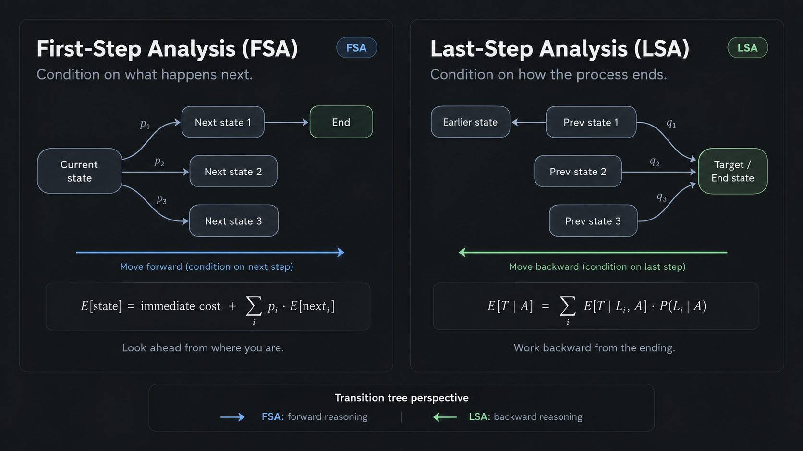

# Problem

Given a biased die with $P(6) = 1/2, P(1) = 1/4$
the game ends when you have seen either a 6 or two 1s ( not necessarily consecutive )
Find both the proba and expected rolls for ending with the double 1 case.

naturally $P(rest) = 1/4$

---

# First step analysis

Most often used to find expectations using $E(\text{remaining for state x})$ aka waiting times.

Per the problem you can be in any "middle" state but it's "first" as you look at where you are
and ask what's next so **conditioned on what happened first** ( I'm here, what's next )

Steps

- $E_{end}$ is the end state, where we want to each, it's redundant here as $E*{end} = 0$, remind that these are "waiting times"
- The actual states we will treat as "first" are, in both these states the games has not ended
  - $E_{0}$ = seen nothing, not a 0 or 1
  - $E_{1}$ = seen one 1

The general FSA conditioning looks like this,
$$E_{\text{first}} = \underbrace{1}_{\substack{\text{one more} \\ \text{step}}} + \sum_{\underbrace{i}_{\substack{\text{next} \\ \text{state}}}} \underbrace{p_i}_{\substack{\text{probability} \\ \text{of state } i}} \underbrace{E_i}_{\substack{\text{time from} \\ \text{state } i}}$$
That $p_i$ must sum to 1 or you have missed a state. It's basically sum of all outgoing edges from here.

$E_0$ step, I've seen nothing where can I go? I can remain here with $1/4$, go to game end with $1/6$ or go to $E_1$ with $1/4$

$$
E_0 = 1 + \frac16 0 + \frac14 E_1  + \frac14 E_0
$$

$E_1$ step, I've seen a 1, where can I go? I can go to game end with $1/4$ via a 1, or with $1/6$ via 6 or remain here with a $1/4$ ( which we don't worry about at all )

$$E_1 = 1 + \frac16 0 + \frac14 0 + \frac14 E_1$$

Then you can just solve.

---

For the probability of ending at 1, you can follow a similar style, though it's a bit forced

$p_0=P(\text{end on 2nd }1\mid 0\text{ ones seen})$

$p_1=P(\text{end on 2nd }1\mid 1\text{ one seen})$

$P(1)=\frac14,\qquad P(6)=\frac12,\qquad P(\text{other})=\frac14$

From 1 one seen, next roll gives success if a 1 appears, failure if a 6 appears, or stays at $p_1$ otherwise.

$p_1=\frac14(1)+\frac12(0)+\frac14p_1$

$\frac34p_1=\frac14$

$p_1=\frac13$

From 0 ones seen, next roll moves to $p_1$ if a 1 appears, fails if a 6 appears, or stays at $p_0$ otherwise.

$p_0=\frac14p_1+\frac12(0)+\frac14p_0$

$\frac34p_0=\frac14\cdot\frac13$

$p_0=\frac19$

$\boxed{P(\text{end on 2nd }1)=\frac19}$

---

# Last step analysis ( LSA )

Let $A=$ game ends on the second 1, $T=$ number of rolls
Given $A$, if we ignore all the "rest" rolls, the only relevant sequence can be

$$
1 \to 1
$$

A relevant roll means either a 1 or a 6, so

$$
P(\text{relevant roll})=P(1)+P(6)=\frac14+\frac12=\frac34
$$

The expected waiting time for the next relevant roll is therefore geometric,

$$
E(W)=\frac{1}{3/4}=\frac43
$$

Conditioned on ending with double 1, we need exactly two relevant rolls: the first 1 and the final 1.

$$
\begin{aligned}
E(T\mid A)
&=E(W_1)+E(W_2)\\
&=\frac43+\frac43\\
&=\boxed{\frac83}
\end{aligned}
$$

**how is this last?**

We start by fixing the **last event**, namely that the game ended in \(A\).

Then we work backwards and ask: _what must have happened immediately before \(A\)?_

Here the last relevant transition must be

$$
1 \to A
$$

and before that, the only relevant transition compatible with ending in \(A\) is

$$
0 \to 1
$$

So conditioning on the final state \(A\) forces the relevant path to be

$$
0 \to 1 \to A
$$

The total time is therefore decomposed into the waiting times along these required transitions,

$$
T=W_0+W_1
$$

and by linearity of expectation,

$$
E[T\mid A]
=
E[W_0\mid A]+E[W_1\mid A]
$$

More generally, if conditioning on ending in $A$ forces a sequence of relevant states

$$
S_0\to S_1\to\cdots\to S_k\to A
$$

and $W_i$ is the waiting time from $S_i$ to the next relevant state on a path that eventually ends in $A$, then

$$
E[T\mid A]
=
\sum_{i=0}^{k}E[W_i\mid A]
$$

So the “last” part is that **we first condition on the ending $A$, then work backwards to determine which preceding states/transitions are compatible with that ending**.

> I think it makes most sense to imagine the transition state graph and then see this as LITERALLY going back from end, vs going from start
> to end

_also, in above if there are branches then it's probability weighted average, but of course those are conditional probabs, which are all 1 here_

---

Ignore other rolls, only $1$ and $6$ matter.

$$
P(1\mid \text{relevant})
=
\frac{1/4}{1/4+1/2}
=
\frac13
$$

Working backward from $A$, the only compatible relevant path is

$$
1\to1.
$$

Therefore,

$$
P(A)
=
\frac13\cdot\frac13
=
\boxed{\frac19}.
$$

## Summary

batchest ai = generated

in this particular problem the branchin i is outward, so an LSA just becomes one path, while FSA becomes multiple where we go to and I'm sure
I can find a problem to illustrate my point but let's leave it here, in general, this is a good rule based on practice

- use **fsa first** for expectation problems
- prob ones depend really, sometimes that "relevant outcome condition" like here really simplifies stuff. I think here you just look at the transition graph and then dedice but I feel lsa is just more intuitive as a sum of individual probabs of the previous states.
